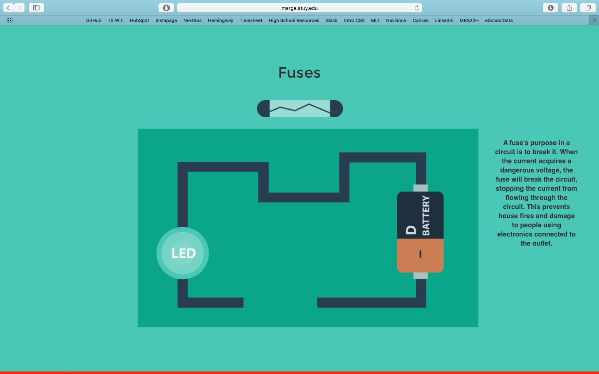

# NewJen
made by Jason Kao and Ashneel Das @ def hacks(NY), 2016
##Intro
The number of humans working in electrical engineering and other computer-hardware-related fields is slowly diminishing. 
We wanted to help regain this field's popularity by creating the site NewJen, which teaches children about
the fundamentals of computer hardware. It features a simple but appealing design, self-created illustrations, and drag and drop images for circuit understanding. The link to the live website in the repository description.
##Preview
Either visit the live <a href="http://marge.stuy.edu/~jason.kao/Github/NewJen">site</a> or open index.html.
##Snapshots

